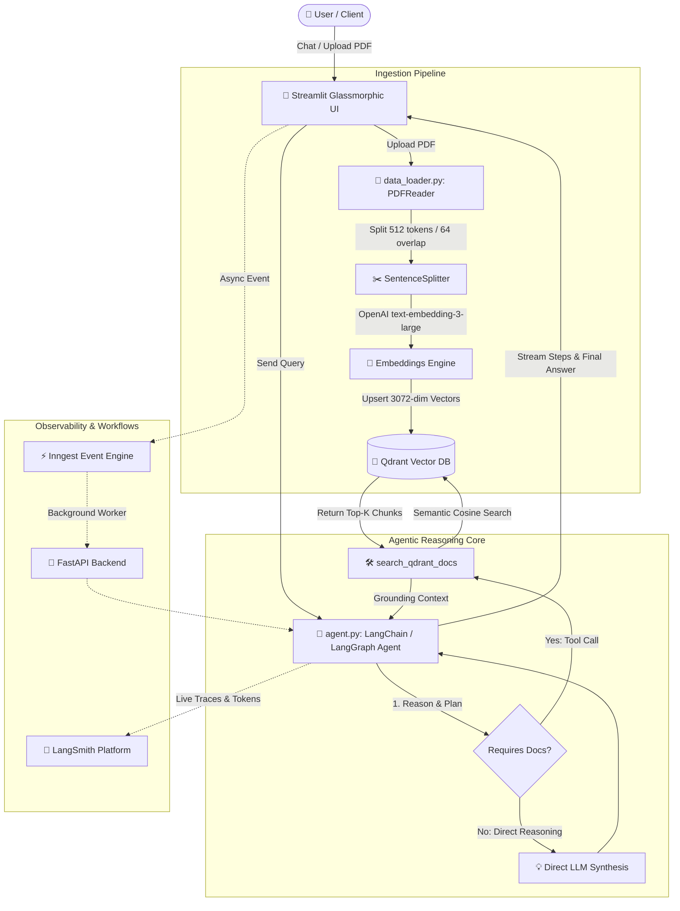

<div align="center">

# 🤖 Production-Grade RAG AI Agent
### Multi-Step Agentic Reasoning • Qdrant Vector DB • Inngest Async Workflows • LangSmith Tracing • Streamlit Chat UI

[](https://www.python.org/)
[](https://www.langchain.com/)
[](https://www.langchain.com/langgraph)
[](https://qdrant.tech/)
[](https://www.inngest.com/)
[](https://streamlit.io/)
[](https://www.docker.com/)

<p align="center">
  <b>A state-of-the-art, production-grade Retrieval-Augmented Generation (RAG) platform with autonomous reasoning agents, asynchronous background event orchestration, vector retrieval, and live observability.</b>
</p>

[Quick Start](#-quick-start-guide) • [Architecture](#-system-architecture) • [How It Works](#-how-it-works-deep-dive) • [UI Walkthrough](#-streamlit-chat-ui-features) • [Docker Deployment](#-docker-deployment) • [Contributing](#-contributing)

</div>

---

## 🌟 Why This Project?

Traditional RAG implementations are often brittle pipelines: they take a user's question, run a naive vector search, stuff matching text chunks into a prompt, and hope for the best. 

This project demonstrates a **Production-Grade Agentic Architecture**:
1. **Dynamic Agent Reasoning:** The AI Agent actively inspects user intent. If the user asks a general question, coding problem, or math calculation, it answers directly. If the user asks about specific company documents or uploaded PDFs, it autonomously queries the vector database using dedicated tool calls.
2. **Transparent Thinking Steps:** Every reasoning loop, tool execution, payload input, and retrieved chunk is exposed in real time through collapsible expanders in the UI.
3. **Enterprise Vector Search:** Powered by **Qdrant** with 3072-dimensional cosine similarity embeddings (`text-embedding-3-large`) and payload metadata filtering.
4. **Resilient Background Workflows:** Built-in **Inngest** event-driven orchestration with **FastAPI** to handle background queuing, retries, and decoupled client-server messaging.
5. **Full-Stack Observability:** Direct integration with **LangSmith** to capture latency, token consumption, prompts, and execution traces for debugging and evaluation.
6. **Polished Dark Glassmorphism UI:** A modern, scrollable chat experience built in **Streamlit** with multi-turn conversation memory (`st.session_state`), file uploaders, and live system health monitors.

---

## 🏗️ System Architecture



> 💡 **Interactive Architecture Diagram:** Open [`diagram.html`](file:///c:/Users/ahmed/Downloads/ProductionGradeRAGPythonApp-main/ProductionGradeRAGPythonApp-main/diagram.html) in your browser to view an interactive animated node diagram of this pipeline.

---

## 🚀 Quick Start Guide

Follow these steps to get the entire application running locally on your machine.

### 1. Clone the Repository
```bash
git clone https://github.com/ahmed-mahmoud-abdelrahman/ProductionGradeRAGPythonApp.git
cd ProductionGradeRAGPythonApp
```

### 2. Set Up Python Environment

You can use modern **`uv`** (recommended) or standard **`pip` / `venv`**:

#### Option A: Using `uv` (Fastest)
```bash
# Install dependencies and sync virtual environment
uv sync

# Activate the virtual environment
# On Linux / macOS:
source .venv/bin/activate
# On Windows (PowerShell):
.venv\Scripts\Activate.ps1
```

#### Option B: Using standard `venv` & `pip`
```bash
# Create virtual environment
python -m venv .venv

# Activate the virtual environment
# On Linux / macOS:
source .venv/bin/activate
# On Windows:
.venv\Scripts\activate

# Install dependencies in editable mode
pip install -e .
```

---

### 3. Configure Environment Variables

Copy the example environment file and add your OpenAI API key:

```bash
# On Linux / macOS:
cp .env.example .env

# On Windows:
copy .env.example .env
```

Open `.env` and configure:
```env
# Required: OpenAI API Key for GPT models & embeddings
OPENAI_API_KEY=sk-proj-xxxxxxxxxxxxxxxxxxxx

# Vector Database (Default is local Qdrant)
QDRANT_URL=http://localhost:6333

# Inngest Event Engine (Default is local dev server)
INNGEST_API_BASE=http://127.0.0.1:8288/v1

# Optional: LangSmith Observability & Tracing
LANGCHAIN_TRACING_V2=true
LANGCHAIN_ENDPOINT=https://api.smith.langchain.com
LANGCHAIN_PROJECT=ProductionGradeRAGAgent
LANGCHAIN_API_KEY=lsv2_pt_xxxxxxxxxxxxxxxxxxxx
```

---

### 4. Start Qdrant Vector Database

Start a local Qdrant instance using Docker:

```bash
docker run -d \
  --name qdrant_local \
  -p 6333:6333 \
  -p 6334:6334 \
  -v $(pwd)/qdrant_storage:/qdrant/storage:z \
  qdrant/qdrant
```

*Verify Qdrant is running:* Open [http://localhost:6333/dashboard](http://localhost:6333/dashboard) in your browser.

---

### 5. Launch the Streamlit Chat Application

Run the Streamlit application:

```bash
streamlit run streamlit_app.py
```

The application will open automatically at **`http://localhost:8501`**.

---

### 6. (Optional) Run FastAPI & Inngest Event Orchestration

If you want to test asynchronous event-driven background processing:

1. **Start FastAPI Backend:**
   ```bash
   uvicorn main:app --reload --port 8000
   ```

2. **Start Inngest Dev Server:**
   ```bash
   npx inngest-cli@latest dev -u http://127.0.0.1:8000/api/inngest
   ```
   Open the Inngest dashboard at [http://localhost:8288](http://localhost:8288).

---

## 🔍 How It Works (Deep Dive)

### 1. Document Ingestion & Chunking (`data_loader.py`)
- **Reading:** Uses LlamaIndex's `PDFReader` to parse uploaded documents into raw text documents.
- **Chunking:** Applies `SentenceSplitter(chunk_size=512, chunk_overlap=64)` to maintain semantic continuity between neighboring fragments.
- **Embedding:** Generates 3072-dimensional vector representations with `text-embedding-3-large`.

### 2. High-Performance Vector Storage (`vector_db.py`)
- Wraps `qdrant-client` to create and maintain the `docs` collection.
- Supports upserting points with rich metadata payload (source filename, chunk index, document text).
- Executes Cosine distance semantic similarity queries with top-K rank selection.

### 3. Agentic Reasoning & Planning Engine (`agent.py`)
- Configured with `ChatOpenAI(model="gpt-4o-mini", temperature=0.2)`.
- Tools available to the agent:
  - `search_qdrant_docs(query, top_k)`: Performs semantic vector lookups when needed.
  - `inspect_indexed_documents()`: Returns collection statistics and indexed point count.
- Dynamic fallback: Answers questions directly using internal knowledge if no document lookup is required, saving latency and API costs.

### 4. Observability with LangSmith
- Attaches `LangChainTracer` to every agent invocation.
- Traces are streamed directly to LangSmith under the `ProductionGradeRAGAgent` project.
- Visualizes run hierarchy, token consumption, prompt inputs, and tool latency.

---

## 🎨 Streamlit Chat UI Features

| Feature | Description |
| :--- | :--- |
| 💬 **Scrollable Chat Memory** | Full multi-turn conversation memory maintained across questions (`st.session_state`). |
| 💭 **Thinking & Planning Expander** | Collapsible UI component detailing which tools were invoked, their input queries, and raw outputs. |
| 📂 **Sidebar PDF Ingestion** | Upload documents on-the-fly; chunk and index them directly into Qdrant in seconds. |
| 🟢 **Live Qdrant Status** | Real-time health badge displaying collection availability and vector count. |
| 🔭 **LangSmith Tracing Input** | Dynamic API key configuration with a 1-click shortcut to the LangSmith dashboard. |
| ⚙️ **Execution Mode Switch** | Switch between direct in-process agent execution and Inngest background event workflows. |

---

## 🐳 Docker Deployment

To spin up the entire application stack using Docker Compose:

```bash
# Build and start all services
docker-compose up --build
```

This launches:
- **FastAPI Backend:** `http://localhost:8000`
- **Qdrant Vector Database:** `http://localhost:6333`
- **Streamlit Web Application:** `http://localhost:8501`

---

## 📂 Project Structure

```plaintext
ProductionGradeRAGPythonApp/
├── agent.py                   # LangChain / LangGraph AI Agent core
├── agents/                    # Multi-Agent scaffolding
│   ├── coordinator.py         # Master workflow orchestrator
│   ├── planner.py             # Task decomposition planner
│   ├── retriever.py           # Vector search worker
│   ├── synthesizer.py         # Response assembler
│   └── run_demo.py            # Local multi-agent test script
├── custom_types.py            # Pydantic models and data types
├── data_loader.py             # PDF reader, sentence chunker & embeddings
├── diagram.html               # Interactive architecture visualization
├── docker-compose.yml         # Multi-container Docker orchestration
├── Dockerfile                 # Container specification
├── main.py                    # FastAPI server & Inngest event functions
├── NEXT_STEPS_MULTI_AGENT.md  # Multi-Agent expansion guide
├── pyproject.toml             # Dependencies and project metadata
├── README.md                  # Comprehensive documentation
├── streamlit_app.py           # Glassmorphic Streamlit Chat UI
├── vector_db.py               # Qdrant client & vector operations
├── WORK_LOG.md                # Development log built from scratch
└── .env.example               # Template environment variables
```

---

## 🛠️ Multi-Agent Extension Roadmap

For enterprise use-cases requiring multi-agent collaboration, check [`NEXT_STEPS_MULTI_AGENT.md`](NEXT_STEPS_MULTI_AGENT.md) and [`agents/`](agents/) for stubs implementing:
- **Coordinator Agent:** Distributes incoming user requests.
- **Planner Agent:** Formulates multi-step execution plans.
- **Retriever Agent:** Queries and filters domain knowledge bases.
- **Synthesizer Agent:** Fuses multi-source outputs into verified answers.

---

## 🤝 Contributing

Contributions, issues, and feature requests are welcome!
1. Fork the Project.
2. Create your Feature Branch (`git checkout -b feature/AmazingFeature`).
3. Commit your Changes (`git commit -m 'Add some AmazingFeature'`).
4. Push to the Branch (`git push origin feature/AmazingFeature`).
5. Open a Pull Request.

---

## 📜 License

Distributed under the MIT License. See `LICENSE` for more information.

<div align="center">
  <sub>Built with ❤️ by <a href="https://github.com/ahmed-mahmoud-abdelrahman">Ahmed Mahmoud</a></sub>
</div>
